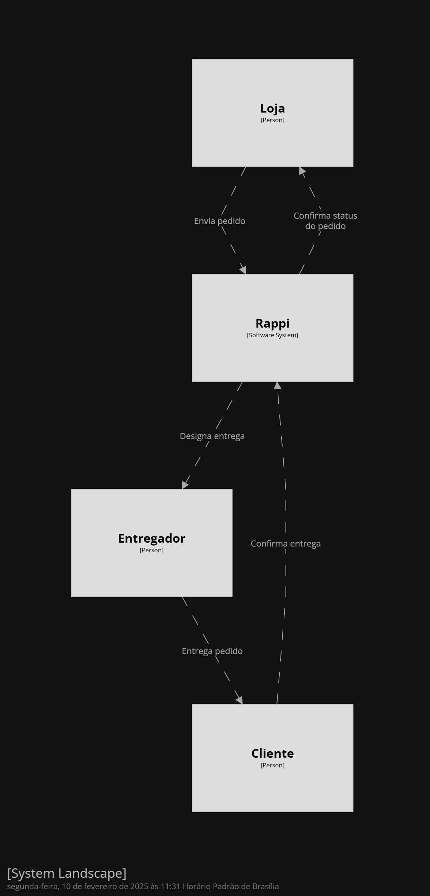
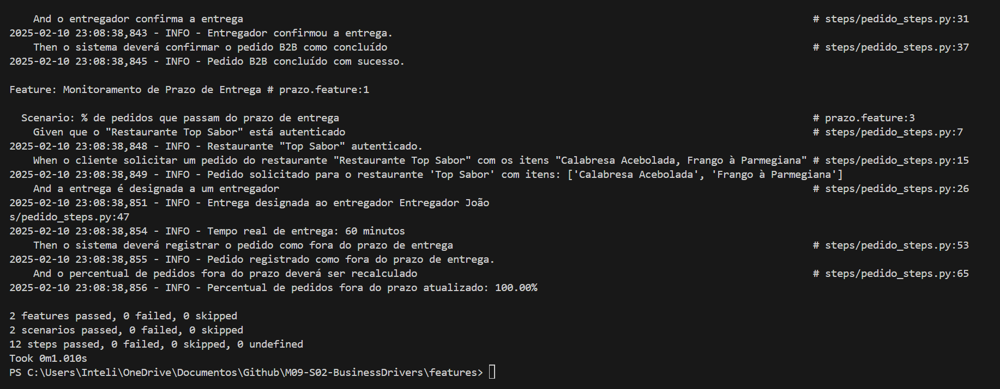
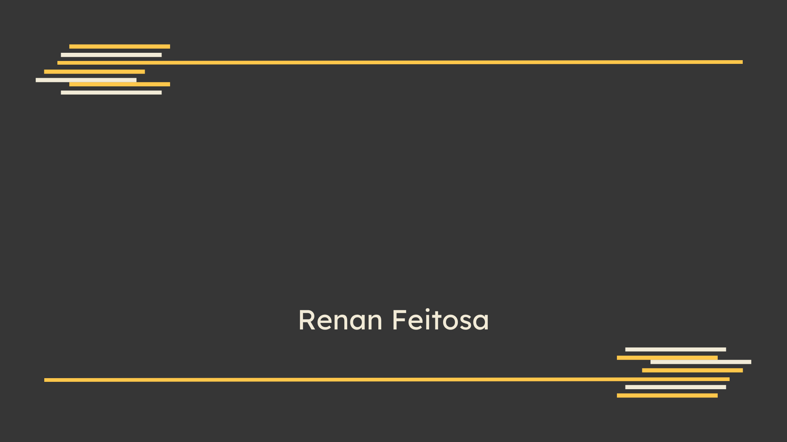

<br>
<br>


# Mapa de Business Drivers 

&emsp;&emsp; O objetivo deste repositório é apresentar o mapa de Business Drivers para pedidos B2B no app dos entregadores da Rappi. O mapa foi criado utilizando a ferramenta [Structurizr](https://structurizr.com/) utilizando o código abaixo.


```
workspace "Rappi B2B Delivery" "Mapa dos Business Drivers para pedidos B2B no app dos entregadores." {

    model {
        loja = person "Loja"
        rappi = softwareSystem "Rappi"
        entregador = person "Entregador"
        cliente = person "Cliente"

        loja -> rappi "Envia pedido"
        rappi -> entregador "Designa entrega"
        entregador -> cliente "Entrega pedido"
        rappi -> loja "Confirma status do pedido"
        cliente -> rappi "Confirma entrega"
    }
    
}

```



<br>
<br>

# Estratégia e massa de testes
&emsp;&emsp; A estratégia de testes para o mapa de Business Drivers foi baseada em testes de aceitação, onde cada um dos drivers foi verificado para garantir que o sistema está funcionando corretamente. Foram realizados utilizando a ferramenta [Gherkin](https://cucumber.io/docs/gherkin/) com a biblioteca [Behave](https://behave.readthedocs.io/en/latest/) em Python. Além disso, é possível ler os testes de aceitação (escritos no padrão Given-When-Then) no diretório features, dentro dos aquivos `pedido.feature` e `entrega.feature`.

&emsp;&emsp; Para rodá-los, basta executar os comandos abaixos.


### Instalar o Behave
```
pip install behave
```

### Rodar os testes
```
cd features
behave
```

O output dos testes será algo parecido com o que está abaixo.



<br>

---

<br>

